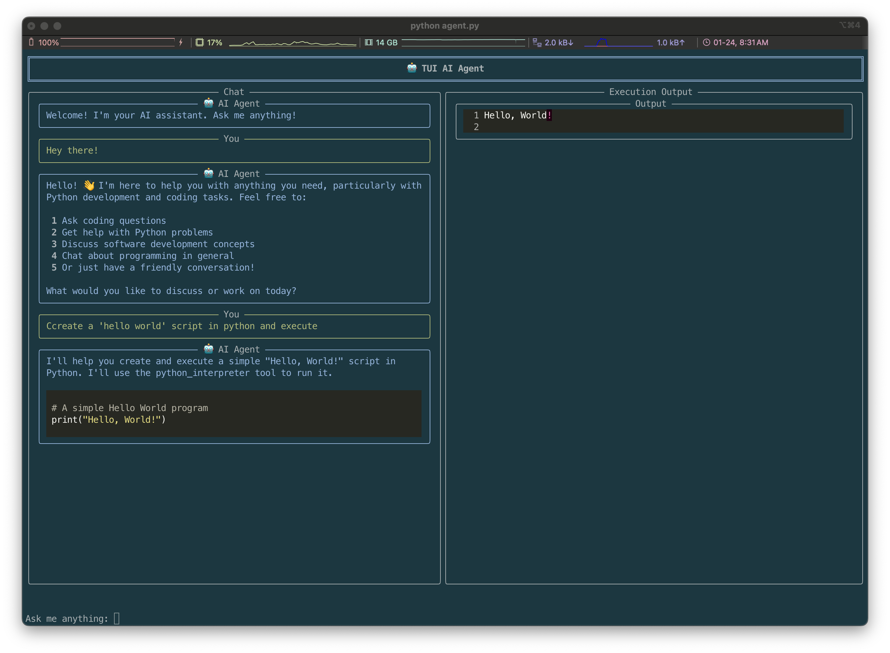

# TUI AI Agent 🤖

A Terminal User Interface (TUI) AI Assistant that provides intelligent responses and code execution capabilities.

<div align="center">
  
</div>

## Project Structure 

src/
├── __init__.py          # Package initialization and version info
├── agent.py             # Main agent controller
├── code_executor.py     # Python code execution handling
├── services/
│   └── llm_service.py   # LLM service integration
├── ui/
│   └── layout_manager.py # TUI layout management
└── prompts/
    └── system.prompt    # System prompts for AI behavior

## Features

- 🎨 Rich TUI interface powered by the Rich library
- 💬 AI-powered responses with streaming capability
- 🚀 Secure Python code execution
- 📝 Markdown rendering support
- ⚡ Real-time status updates
- 🛡️ Resource-managed execution environment

## Installation

1. Clone the repository:

```bash
git clone https://github.com/josebenitezg/agentui.git
cd tui-ai-agent
```

2. Create and activate a virtual environment:

```bash
python -m venv venv
source venv/bin/activate  # On Windows: venv\Scripts\activate
```

3. Install required dependencies:

```bash
pip install -r requirements.txt
```

4. Create a `.env` file with your configuration:

```bash
ANTHROPIC_API_KEY=your_api_key_here
```

## Usage

To start the TUI AI Agent:

```bash
python -m src.agent
```

## Components

### Layout Manager
The UI component uses Rich library for:
- Console output formatting
- Dynamic layout management
- Panel rendering
- Markdown and syntax highlighting

### Agent
Core controller that manages:
- User interactions
- AI response processing
- Code execution coordination
- Layout updates

### Code Executor
Handles Python code execution with:
- Memory usage limits
- Timeout protection
- Input/Output capture
- Error handling

### LLM Service
Manages AI communication with:
- Message streaming
- Tool integration
- System prompt handling
- Response formatting

## Development

### Prerequisites
- Python 3.8+
- Virtual environment
- Anthropic API key


## Testing

The project emphasizes:
- Code validation
- Input/output testing
- Edge case handling
- Performance optimization
- Proactive bug detection

## Contributing

1. Fork the repository
2. Create your feature branch (`git checkout -b feature/amazing-feature`)
3. Commit your changes (`git commit -m 'Add amazing feature'`)
4. Push to the branch (`git push origin feature/amazing-feature`)
5. Open a Pull Request

## License

[Add your license information here]

## Acknowledgments

- [Rich](https://github.com/Textualize/rich) for the TUI components
- [Anthropic](https://www.anthropic.com/) for the Claude AI model